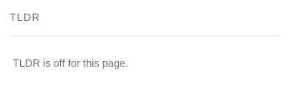
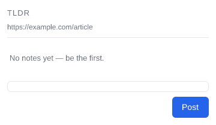
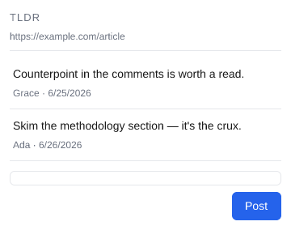
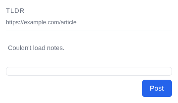
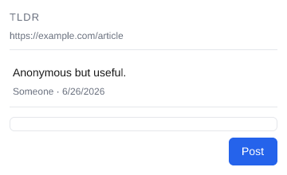
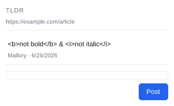
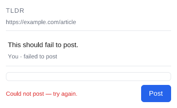

# TLDR extension — UI requirements

The **specific, testable UI requirements** for the extension's two user-facing surfaces — the
**side panel** (`client/src/sidepanel.{html,css,mjs}`) and the **options page**
(`client/src/options.{html,mjs}`): what they must render, how they must behave, and the exact copy,
structure, and accessibility semantics they must carry.

This is the **executable** half of the spec: every leaf below carries a stable number and is claimed
by exactly one **case** that proves it, of exactly one **kind** of verification. The build is red the
moment a leaf is added without a case (`requirements-coverage.test.mjs`). See [README.md](README.md)
for the methodology, the kinds, and the owner-approval contract.

> # ⚠️ A GREEN BUILD MEANS "CLAIMED", NOT "FULLY VERIFIED" ⚠️
>
> Every leaf is *claimed* by one case of the right kind, so the coverage gate proves each leaf is
> verified by the kind of test it needs. What it does **not** prove is end-to-end fidelity: the `dom`
> and `behavior` cases drive the **real** `sidepanel.mjs` / `options.mjs` under **jsdom + a fake
> `chrome.*`** — faithful to our *model* of Chrome, but not proof that a *real* Chrome loads the
> extension and paints the panel. That last layer is tracked as the `tbd` leaf `8.1`.

**Numbering.** Every leaf carries a stable dotted number (e.g. `1.3`). Its one case is named
`<slug>.<id>.case.mjs` where `<slug>` is the section's component/feature name, so a case and the
requirement it pins cross-check by number. Add new requirements with new numbers; don't renumber or
reuse existing ones.

**How each leaf is verified is declared by its CASE (its folder), not tagged here.** The left cell of
each row is **generated** from the case (the rendered image for a `dom` leaf, a note for a coded
leaf); don't hand-edit a line carrying a `<!-- req-gallery:… -->` marker — run `npm run refresh:ui`.

---

## 1. Side panel — states

The panel is a small state machine over the active tab. Each state below is pinned by a `dom` image:
the panel's real `render()` run against faked inputs, rasterized with the real `sidepanel.css` for
visual approval.

<table>
<tr>
<td valign="top" width="340">

 <!-- req-gallery:1.1 -->

</td>
<td valign="top">

`1.1` On a **non-commentable** page (a denylisted host, or a non-http(s)/unparseable URL), the panel
shows the status **"TLDR is off for this page."**, an **empty** page line, and **no** composer.

</td>
</tr>
</table>

<table>
<tr>
<td valign="top" width="340">

 <!-- req-gallery:1.2 -->

</td>
<td valign="top">

`1.2` On a **commentable** page with **no notes**, the header shows the constant title **"TLDR"** and
the page line shows the page's normalized id (mirrored in its `title` tooltip), the status reads
**"No notes yet — be the first."**, and the **composer is shown**.

</td>
</tr>
</table>

<table>
<tr>
<td valign="top" width="340">

 <!-- req-gallery:1.3 -->

</td>
<td valign="top">

`1.3` Each note renders as a **list item** carrying its body and a meta line
**"&lt;author&gt; · &lt;time&gt;"**, ordered **oldest first / newest last**.

</td>
</tr>
</table>

<table>
<tr>
<td valign="top" width="340">

 <!-- req-gallery:1.4 -->

</td>
<td valign="top">

`1.4` When the notes read **fails** and there's nothing to show, the status reads
**"Couldn't load notes."** (rather than the panel looking merely empty).

</td>
</tr>
</table>

<table>
<tr>
<td valign="top" width="340">

 <!-- req-gallery:1.5 -->

</td>
<td valign="top">

`1.5` A note with **no author name** is attributed to **"Someone"** — never a blank byline.

</td>
</tr>
</table>

<table>
<tr>
<td valign="top" width="340">

 <!-- req-gallery:1.6 -->

</td>
<td valign="top">

`1.6` A note body that **looks like HTML** renders as **literal visible text** — the markup shows as
characters, not parsed into elements. (The security counterpart — that no element is actually
injected — is `3.3`.)

</td>
</tr>
</table>

<table>
<tr>
<td valign="top" width="340">

 <!-- req-gallery:1.7 -->

</td>
<td valign="top">

`1.7` A just-posted note appears **immediately** in a **pending** treatment
(**"&lt;author&gt; · posting…"**, muted) before the server confirms it.

</td>
</tr>
</table>

<table>
<tr>
<td valign="top" width="340">

 <!-- req-gallery:1.8 -->

</td>
<td valign="top">

`1.8` When a post **fails**, the note stays visible in a **failed** treatment
(**"&lt;author&gt; · failed to post"**) and the composer shows an inline error — the user's text is
never lost.

</td>
</tr>
</table>

## 2. Posting a note

The post gesture and its effects — what a static snapshot can't observe, so these are `behavior`
cases driving the real composer and asserting the DOM + the network calls.

<table>
<tr>
<td valign="top" width="340">

🚩 _Behavior leaf — verified by `behavior/behavior.test.mjs` (a gesture a static snapshot can't show)._ <!-- req-gallery:2.1 -->

</td>
<td valign="top">

`2.1` Submitting a note **inserts it optimistically** (shown at once) and **disables Post** while the
write is in flight; the textarea clears.

</td>
</tr>
</table>

<table>
<tr>
<td valign="top" width="340">

🚩 _Behavior leaf — verified by `behavior/behavior.test.mjs` (a gesture a static snapshot can't show)._ <!-- req-gallery:2.2 -->

</td>
<td valign="top">

`2.2` On **success** the optimistic note **reconciles** to a confirmed note (the pending treatment
drops) and **Post re-enables**. The write carries a **bearer token**; the read carries **none**
(reads are public/cache-friendly).

</td>
</tr>
</table>

<table>
<tr>
<td valign="top" width="340">

🚩 _Behavior leaf — verified by `behavior/behavior.test.mjs` (a gesture a static snapshot can't show)._ <!-- req-gallery:2.3 -->

</td>
<td valign="top">

`2.3` On **failure** the note is **marked failed**, the composer shows **"Could not post — try
again."**, and **Post re-enables** for a retry.

</td>
</tr>
</table>

<table>
<tr>
<td valign="top" width="340">

🚩 _Behavior leaf — verified by `behavior/behavior.test.mjs` (a gesture a static snapshot can't show)._ <!-- req-gallery:2.4 -->

</td>
<td valign="top">

`2.4` An **empty or whitespace-only** body **does not post** and adds **no** note.

</td>
</tr>
</table>

## 3. Accessibility & safety

The semantics assistive tech and the security model depend on. The static-markup contracts (`3.1`,
`3.2`, `3.4`) are `logic` cases asserted against the shipped HTML; the XSS guard (`3.3`) is a
`behavior` case (it needs the real render of an untrusted body).

<table>
<tr>
<td valign="top" width="340">

🔧 _Logic leaf — verified by `logic/logic.test.mjs`._ <!-- req-gallery:3.1 -->

</td>
<td valign="top">

`3.1` The notes list is an **`aria-live="polite"`** region, so a newly arriving note is announced.

</td>
</tr>
</table>

<table>
<tr>
<td valign="top" width="340">

🔧 _Logic leaf — verified by `logic/logic.test.mjs`._ <!-- req-gallery:3.2 -->

</td>
<td valign="top">

`3.2` The composer error is a **`role="alert"`** live region, so a post failure is announced.

</td>
</tr>
</table>

<table>
<tr>
<td valign="top" width="340">

🚩 _Behavior leaf — verified by `behavior/behavior.test.mjs` (a gesture a static snapshot can't show)._ <!-- req-gallery:3.3 -->

</td>
<td valign="top">

`3.3` A note body is inserted as **text, never parsed as HTML**: a body crafted to inject an element
produces **no such element** in the DOM, and the body's text equals the raw string (XSS-safe).

</td>
</tr>
</table>

<table>
<tr>
<td valign="top" width="340">

🔧 _Logic leaf — verified by `logic/logic.test.mjs`._ <!-- req-gallery:3.4 -->

</td>
<td valign="top">

`3.4` The composer textarea **caps input at maxlength 8192** and carries the **placeholder prompt**,
and **Post is a submit-type button** (keyboard-reachable, Enter/click submits).

</td>
</tr>
</table>

## 4. Note time formatting

How a note's age reads on its meta line. The formatter is private to `sidepanel.mjs`, so each leaf is
a `logic` case verified **through the real render** at a fixed offset from the pinned reference
instant (`shared/reference-time.mjs`).

<table>
<tr>
<td valign="top" width="340">

🔧 _Logic leaf — verified by `logic/logic.test.mjs`._ <!-- req-gallery:4.1 -->

</td>
<td valign="top">

`4.1` A note **under a minute** old reads **"just now"**.

</td>
</tr>
</table>

<table>
<tr>
<td valign="top" width="340">

🔧 _Logic leaf — verified by `logic/logic.test.mjs`._ <!-- req-gallery:4.2 -->

</td>
<td valign="top">

`4.2` A note **minutes** old reads **"Nm ago"**.

</td>
</tr>
</table>

<table>
<tr>
<td valign="top" width="340">

🔧 _Logic leaf — verified by `logic/logic.test.mjs`._ <!-- req-gallery:4.3 -->

</td>
<td valign="top">

`4.3` A note **hours** old reads **"Nh ago"**.

</td>
</tr>
</table>

<table>
<tr>
<td valign="top" width="340">

🔧 _Logic leaf — verified by `logic/logic.test.mjs`._ <!-- req-gallery:4.4 -->

</td>
<td valign="top">

`4.4` A note **a day or more** old reads the **absolute locale date** (it stops being "hours ago").

</td>
</tr>
</table>

<table>
<tr>
<td valign="top" width="340">

🔧 _Logic leaf — verified by `logic/logic.test.mjs`._ <!-- req-gallery:4.5 -->

</td>
<td valign="top">

`4.5` A note with **no timestamp** shows an **empty time** — never a bogus date or "NaN".

</td>
</tr>
</table>

## 5. Note render model (covered by unit tests — no leaves here)

The non-visual model the panel renders from is already covered by the existing `client/test/` unit
suites, so — like the reference project's events-model section — there are **no separate leaves
here**, to avoid a parallel, drift-prone duplicate:

- **The optimistic merge** (dedupe by id with the server winning, chronological order, the
  pending→confirmed→failed transitions) — `client/test/optimistic.test.mjs`.
- **The page commentability gate** (the two-layer denylist; host-suffix matching) —
  `client/test/denylist.test.mjs`.
- **The read/write API split** (public read, bearer write, the 401-refresh-retry) —
  `client/test/api.test.mjs`.
- **The Google ID-token helpers** (URL building, nonce/state, expiry) — `client/test/auth.test.mjs`.

The rendered §1–§4 requirements are the executable UI contract over that model.

## 6. Options page

The denylist editor (`client/src/options.{html,mjs}`).

<table>
<tr>
<td valign="top" width="340">

 <!-- req-gallery:6.1 -->

</td>
<td valign="top">

`6.1` The options page renders the denylist editor: the **heading**, the **helper text**, a
**textarea seeded** with the stored denylist (one host per line), and a **Save** button.

</td>
</tr>
</table>

<table>
<tr>
<td valign="top" width="340">

🚩 _Behavior leaf — verified by `behavior/behavior.test.mjs` (a gesture a static snapshot can't show)._ <!-- req-gallery:6.2 -->

</td>
<td valign="top">

`6.2` Saving **normalizes** the list (trim, lowercase, drop blank lines) and **dedupes** it, then
**persists** it to `chrome.storage.sync` and confirms with **"Saved."**; the normalized list is
reflected back into the textarea.

</td>
</tr>
</table>

<table>
<tr>
<td valign="top" width="340">

🚩 _Behavior leaf — verified by `behavior/behavior.test.mjs` (a gesture a static snapshot can't show)._ <!-- req-gallery:6.3 -->

</td>
<td valign="top">

`6.3` The **"Saved."** confirmation is **transient** — it clears a short time after the save.

</td>
</tr>
</table>

## 7. Manifest UI surfaces

The user-facing entry points declared in the manifest (distinct from the packaging/least-privilege
guards in `client/test/manifest.test.mjs`).

<table>
<tr>
<td valign="top" width="340">

🔧 _Logic leaf — verified by `logic/logic.test.mjs`._ <!-- req-gallery:7.1 -->

</td>
<td valign="top">

`7.1` The toolbar **action** is titled **"Open TLDR notes"** — the hover affordance for what clicking
the icon does.

</td>
</tr>
</table>

<table>
<tr>
<td valign="top" width="340">

🔧 _Logic leaf — verified by `logic/logic.test.mjs`._ <!-- req-gallery:7.2 -->

</td>
<td valign="top">

`7.2` The **options page** (denylist editor) is registered as the extension's **options UI**
(`options_ui` → `src/options.html`).

</td>
</tr>
</table>

## 8. Real-browser end-to-end

<table>
<tr>
<td valign="top" width="340">

⚠️ _Behavior leaf — **untested here** — covered today by `node --check of the chrome.* glue in .github/workflows/client.yml (a real-Chrome e2e is a tracked follow-up)`._ <!-- req-gallery:8.1 -->

</td>
<td valign="top">

`8.1` **(tbd)** The unpacked extension loads in a **real Chrome**: the toolbar click opens the side
panel and the service-worker glue runs. Today only partially covered (the `node --check` syntax pass
in CI catches a typo in the `chrome.*` glue); a real-Chrome e2e is a tracked follow-up.

</td>
</tr>
</table>
