# TLDR extension — UI requirements

The **specific, testable UI requirements** for the extension's two user-facing surfaces — the
**side panel** (`client/src/sidepanel.{html,css,mjs}`) and the **options page**
(`client/src/options.{html,mjs}`): what they must render, how they must behave, and the exact copy,
structure, and accessibility semantics they must carry.

This is the **executable** half of the spec: every leaf below carries a stable number and is claimed
by exactly one **case** that proves it, of exactly one **kind** of verification. The build is red the
moment a leaf is added without a case (`requirements-coverage.test.mjs`). See [README.md](README.md)
for the methodology, the kinds, and the owner-approval contract.

> # ⚠️ A GREEN BUILD MEANS "CLAIMED", NOT "FULLY VERIFIED" ⚠️
>
> Every leaf is *claimed* by one case of the right kind, so the coverage gate proves each leaf is
> verified by the kind of test it needs. What it does **not** prove is end-to-end fidelity: the `dom`
> and `behavior` cases drive the **real** `sidepanel.mjs` / `options.mjs` under **jsdom + a fake
> `chrome.*`** — faithful to our *model* of Chrome, but not proof that a *real* Chrome loads the
> extension and paints the panel. That last layer is tracked as the `tbd` leaf `8.1`.

**Numbering.** Every leaf carries a stable dotted number (e.g. `1.3`). Its one case is named
`<slug>.<id>.case.mjs` where `<slug>` is the section's component/feature name, so a case and the
requirement it pins cross-check by number. Add new requirements with new numbers; don't renumber or
reuse existing ones.

**How each leaf is verified is declared by its CASE (its folder), not tagged here.** The left cell of
each row is **generated** from the case (the rendered image for a `dom` leaf, a note for a coded
leaf); don't hand-edit a line carrying a `<!-- req-gallery:… -->` marker — run `npm run refresh:ui`.

---

## 1. Side panel — states

The panel is a small state machine over the active tab. Each state below is pinned by a `dom` image:
the panel's real `render()` run against faked inputs, rasterized with the real `sidepanel.css` for
visual approval.

<table>
<tr>
<td valign="top" width="340">

 <!-- req-gallery:1.1 -->

</td>
<td valign="top">

`1.1` On a **non-commentable** page (a denylisted host, or a non-http(s)/unparseable URL), the panel
shows the status **"TLDR is off for this page."**, an **empty** page line, and **no** composer.

</td>
</tr>
</table>

<table>
<tr>
<td valign="top" width="340">

 <!-- req-gallery:1.2 -->

</td>
<td valign="top">

`1.2` On a **commentable** page with **no notes**, the header shows the constant title **"TLDR"** and
the page line shows the page's normalized id (mirrored in its `title` tooltip), the status reads
**"No notes yet — be the first."**, and the **composer is shown**.

</td>
</tr>
</table>

<table>
<tr>
<td valign="top" width="340">

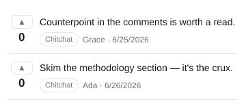 <!-- req-gallery:1.3 -->

</td>
<td valign="top">

`1.3` Each note renders as a **list item** carrying its body and a meta line
**"&lt;author&gt; · &lt;time&gt;"**, ordered **oldest first / newest last**.

</td>
</tr>
</table>

<table>
<tr>
<td valign="top" width="340">

 <!-- req-gallery:1.4 -->

</td>
<td valign="top">

`1.4` When the notes read **fails** and there's nothing to show, the status reads
**"Couldn't load notes."** (rather than the panel looking merely empty).

</td>
</tr>
</table>

<table>
<tr>
<td valign="top" width="340">

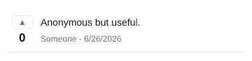 <!-- req-gallery:1.5 -->

</td>
<td valign="top">

`1.5` A note with **no author name** is attributed to **"Someone"** — never a blank byline.

</td>
</tr>
</table>

<table>
<tr>
<td valign="top" width="340">

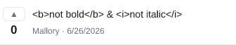 <!-- req-gallery:1.6 -->

</td>
<td valign="top">

`1.6` A note body that **looks like HTML** renders as **literal visible text** — the markup shows as
characters, not parsed into elements. (The security counterpart — that no element is actually
injected — is `3.3`.)

</td>
</tr>
</table>

## 2. Posting a note

What happens when you add a note, and who's allowed to. The **flow is shown as the panel actually
looks** at each step — *posting* (`2.1`), *saved* (`2.2`), *failed* (`2.3`) — driven by the real
gesture with the save mocked to land each outcome; the note's treatment **and Post's
enabled/disabled state** are the visible proof. The `behavior` leaves cover what an image can't (an
empty note posts nothing; reading is anonymous), and the `server` leaves prove the server itself
decides who may post.

<table>
<tr>
<td valign="top" width="340">

 <!-- req-gallery:2.1 -->

</td>
<td valign="top">

`2.1` When you press **Post**, your note appears **immediately** as **"posting…"** and **Post** is
**disabled** until it's saved — so you see it took and can't double-post.

</td>
</tr>
</table>

<table>
<tr>
<td valign="top" width="340">

 <!-- req-gallery:2.2 -->

</td>
<td valign="top">

`2.2` Once the save **succeeds**, your note becomes a **normal saved note** and **Post** is
**enabled** again.

</td>
</tr>
</table>

<table>
<tr>
<td valign="top" width="340">

 <!-- req-gallery:2.3 -->

</td>
<td valign="top">

`2.3` If the save **fails**, your note **isn't lost** — it stays, marked **failed**, the box shows
**"Could not post — try again."**, and **Post** is **enabled** again so you can retry.

</td>
</tr>
</table>

<table>
<tr>
<td valign="top" width="340">

🚩 _Behavior leaf — verified by `behavior/behavior.test.mjs` (a gesture a static snapshot can't show)._ <!-- req-gallery:2.4 -->

</td>
<td valign="top">

`2.4` An **empty or whitespace-only** note doesn't post and adds nothing.

</td>
</tr>
</table>

<table>
<tr>
<td valign="top" width="340">

🚩 _Behavior leaf — verified by `behavior/behavior.test.mjs` (a gesture a static snapshot can't show)._ <!-- req-gallery:2.5 -->

</td>
<td valign="top">

`2.5` You can **read** notes without signing in; **posting** attaches your signed-in identity.
_(Cross-tier: this is the UI half; the server enforcement is `2.6`.)_

</td>
</tr>
</table>

<table>
<tr>
<td valign="top" width="340">

`POST /comments` — no auth, body `{"pageUrl":"https://example.com/x","body":"hi"}` → `401` missing authenticated identity <!-- req-gallery:2.6 -->

</td>
<td valign="top">

`2.6` **Only signed-in people can post** — the guarantee is the **server's**: a write with no
signed-in identity is rejected. _(Cross-tier: the UI half is `2.5`; this is the server enforcement.)_

</td>
</tr>
</table>

<table>
<tr>
<td valign="top" width="340">

`POST /comments` — sub user-123 · email_verified=false, body `{"pageUrl":"https://example.com/x","body":"hi"}` → `403` a verified Google email is required to post <!-- req-gallery:2.7 -->

</td>
<td valign="top">

`2.7` **A verified email is required to post** — the server rejects a signed-in user whose Google
email isn't verified.

</td>
</tr>
</table>

## 3. Safety, limits & accessibility

What keeps the panel safe, bounded, and usable by everyone — stated as product behavior. *How* each
is checked (a screen-reader live region, the shipped markup, the server's response) is the
verification detail, not the requirement.

<table>
<tr>
<td valign="top" width="340">

🔧 _Logic leaf — verified by `logic/logic.test.mjs`._ <!-- req-gallery:3.1 -->

</td>
<td valign="top">

`3.1` When a new note arrives while the panel is open, a **screen-reader user is told about it**
without having to go looking. _(How: the notes list is an `aria-live="polite"` region.)_

</td>
</tr>
</table>

<table>
<tr>
<td valign="top" width="340">

🔧 _Logic leaf — verified by `logic/logic.test.mjs`._ <!-- req-gallery:3.2 -->

</td>
<td valign="top">

`3.2` When a post fails, a **screen-reader user is told about the error** the moment it appears.
_(How: the error is a `role="alert"` live region.)_

</td>
</tr>
</table>

<table>
<tr>
<td valign="top" width="340">

🚩 _Behavior leaf — verified by `behavior/behavior.test.mjs` (a gesture a static snapshot can't show)._ <!-- req-gallery:3.3 -->

</td>
<td valign="top">

`3.3` **Reading a note can never run code.** A note that contains HTML or a `<script>` shows as
**plain text** — it's never run or rendered as markup. _(How: the body is inserted as text, so a
crafted body injects no element. The server stores the note verbatim — it's content-agnostic — so
this safety lives where the note is shown.)_

</td>
</tr>
</table>

<table>
<tr>
<td valign="top" width="340">

🔧 _Logic leaf — verified by `logic/logic.test.mjs`._ <!-- req-gallery:3.4 -->

</td>
<td valign="top">

`3.4` The note box **shows a prompt** for what to write and **caps very long notes**; you can post
with the button or the keyboard. _(How: the textarea's placeholder + `maxlength` 8192, and Post is a
submit-type button.)_

</td>
</tr>
</table>

<table>
<tr>
<td valign="top" width="340">

`POST /comments` — a verified signed-in user, body `9000 bytes (over the 8192-byte cap)` → `413` comment body exceeds 8192 bytes <!-- req-gallery:3.5 -->

</td>
<td valign="top">

`3.5` **A note over the size limit (~8 KB) is rejected** — and the guarantee is the **server's**, so
a client that bypasses the box's cap still can't store an oversized note. _(Cross-tier: the UI cap is
`3.4`; this is the server enforcement.)_

</td>
</tr>
</table>

## 4. Note time formatting

How a note's age reads on its meta line — visible UI, so each leaf is a `dom` image: a note rendered
at a fixed offset from the pinned reference instant (`shared/reference-time.mjs`), its meta line the
approved artifact.

<table>
<tr>
<td valign="top" width="340">

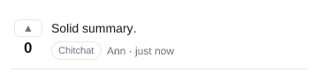 <!-- req-gallery:4.1 -->

</td>
<td valign="top">

`4.1` A note **under a minute** old reads **"just now"**.

</td>
</tr>
</table>

<table>
<tr>
<td valign="top" width="340">

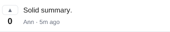 <!-- req-gallery:4.2 -->

</td>
<td valign="top">

`4.2` A note **minutes** old reads **"Nm ago"**.

</td>
</tr>
</table>

<table>
<tr>
<td valign="top" width="340">

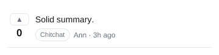 <!-- req-gallery:4.3 -->

</td>
<td valign="top">

`4.3` A note **hours** old reads **"Nh ago"**.

</td>
</tr>
</table>

<table>
<tr>
<td valign="top" width="340">

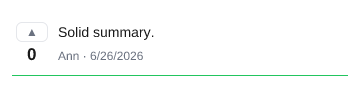 <!-- req-gallery:4.4 -->

</td>
<td valign="top">

`4.4` A note **a day or more** old reads the **absolute locale date** (it stops being "hours ago").

</td>
</tr>
</table>

<table>
<tr>
<td valign="top" width="340">

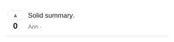 <!-- req-gallery:4.5 -->

</td>
<td valign="top">

`4.5` A note with **no timestamp** shows an **empty time** — never a bogus date or "NaN".

</td>
</tr>
</table>

## 5. Note render model (covered by unit tests — no leaves here)

The non-visual model the panel renders from is already covered by the existing `client/test/` unit
suites, so — like the reference project's events-model section — there are **no separate leaves
here**, to avoid a parallel, drift-prone duplicate:

- **The optimistic merge** (dedupe by id with the server winning, chronological order, the
  pending→confirmed→failed transitions) — `client/test/optimistic.test.mjs`.
- **The page commentability gate** (the two-layer denylist; host-suffix matching) —
  `client/test/denylist.test.mjs`.
- **The read/write API split** (public read, bearer write, the 401-refresh-retry) —
  `client/test/api.test.mjs`.
- **The Google ID-token helpers** (URL building, nonce/state, expiry) — `client/test/auth.test.mjs`.

The rendered §1–§4 requirements are the executable UI contract over that model.

## 6. Options page

The denylist editor (`client/src/options.{html,mjs}`).

<table>
<tr>
<td valign="top" width="340">

 <!-- req-gallery:6.1 -->

</td>
<td valign="top">

`6.1` The options page renders the denylist editor: the **heading**, the **helper text**, a
**textarea seeded** with the stored denylist (one host per line), and a **Save** button.

</td>
</tr>
</table>

<table>
<tr>
<td valign="top" width="340">

🚩 _Behavior leaf — verified by `behavior/behavior.test.mjs` (a gesture a static snapshot can't show)._ <!-- req-gallery:6.2 -->

</td>
<td valign="top">

`6.2` Saving **normalizes** the list (trim, lowercase, drop blank lines) and **dedupes** it, then
**persists** it to `chrome.storage.sync` and confirms with **"Saved."**; the normalized list is
reflected back into the textarea.

</td>
</tr>
</table>

<table>
<tr>
<td valign="top" width="340">

🚩 _Behavior leaf — verified by `behavior/behavior.test.mjs` (a gesture a static snapshot can't show)._ <!-- req-gallery:6.3 -->

</td>
<td valign="top">

`6.3` The **"Saved."** confirmation is **transient** — it clears a short time after the save.

</td>
</tr>
</table>

## 7. Manifest UI surfaces

The user-facing entry points declared in the manifest (distinct from the packaging/least-privilege
guards in `client/test/manifest.test.mjs`).

<table>
<tr>
<td valign="top" width="340">

🔧 _Logic leaf — verified by `logic/logic.test.mjs`._ <!-- req-gallery:7.1 -->

</td>
<td valign="top">

`7.1` The toolbar **action** is titled **"Open TLDR notes"** — the hover affordance for what clicking
the icon does.

</td>
</tr>
</table>

<table>
<tr>
<td valign="top" width="340">

🔧 _Logic leaf — verified by `logic/logic.test.mjs`._ <!-- req-gallery:7.2 -->

</td>
<td valign="top">

`7.2` The **options page** (denylist editor) is registered as the extension's **options UI**
(`options_ui` → `src/options.html`).

</td>
</tr>
</table>

## 8. Real-browser end-to-end

<table>
<tr>
<td valign="top" width="340">

⚠️ _Behavior leaf — **untested here** — covered today by `node --check of the chrome.* glue in .github/workflows/client.yml (a real-Chrome e2e is a tracked follow-up)`._ <!-- req-gallery:8.1 -->

</td>
<td valign="top">

`8.1` **(tbd)** The unpacked extension loads in a **real Chrome**: the toolbar click opens the side
panel and the service-worker glue runs. Today only partially covered (the `node --check` syntax pass
in CI catches a typo in the `chrome.*` glue); a real-Chrome e2e is a tracked follow-up.

</td>
</tr>
</table>

## 9. Upvoting

Endorsing a note. Each saved comment carries a **vote rail on its left** — the upvote button above the
count (a larger font) — and a signed-in user can cast one vote per comment and toggle it off. The
**count rides the shared, CDN-cached public read** (so it's stale up to the ~60s TTL and identical for
every viewer — an accepted trade-off, issue #22); the **viewer's own vote can't** ride that read (the
cache key excludes `Authorization`), so it's shown optimistically and persisted client-side
(`chrome.storage.local`). One user can't upvote twice: the vote is a single keyed item cast under an
`attribute_not_exists` condition, so a repeat is an idempotent no-op (leaf `9.7`). The voted/un-voted
look is a `dom` image; the optimistic toggle + rollback are `behavior` gestures; the merge rule is a
`logic` leaf; and the server enforcement (attributed, idempotent, no identity leak) sits alongside as
`server` leaves.

> Voted-by-me is a **filled accent button** (vs a muted outline when un-voted) with an accent count —
> unmistakably "you've already voted", and a non-colour cue (filled vs outline), not colour alone. You
> can't stack a second vote: clicking a voted control **removes** your vote (its title says so and its
> `aria-pressed`/accessible name carry the state to assistive tech).

<table>
<tr>
<td valign="top" width="340">

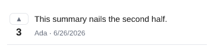 <!-- req-gallery:9.1 -->

</td>
<td valign="top">

`9.1` A saved comment renders a **vote rail on its left** — the ▲ button above the count — in the
**un-voted** state (muted), e.g. `3`.

</td>
</tr>
</table>

<table>
<tr>
<td valign="top" width="340">

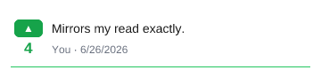 <!-- req-gallery:9.2 -->

</td>
<td valign="top">

`9.2` The same rail in the **voted-by-me** state — a **filled accent** button and an accent count (the
count including your vote), so it's clear you've already voted.

</td>
</tr>
</table>

<table>
<tr>
<td valign="top" width="340">

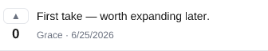 <!-- req-gallery:9.3 -->

</td>
<td valign="top">

`9.3` A comment with **zero** votes still renders the affordance showing **`0`** — the control is
never missing.

</td>
</tr>
</table>

<table>
<tr>
<td valign="top" width="340">

click ▲ → `POST /comments/{id}/vote` (count 3→4); click again → `DELETE /comments/{id}/vote` (count 4→3) <!-- req-gallery:9.4 -->

</td>
<td valign="top">

`9.4` Clicking the control **optimistically increments** the count and **flips to voted**; clicking
again **toggles back** (count restored). _(Cross-tier: the server enforcement is `9.7`/`9.8`.)_

</td>
</tr>
</table>

<table>
<tr>
<td valign="top" width="340">

🚩 _Behavior leaf — verified by `behavior/behavior.test.mjs` (a gesture a static snapshot can't show)._ <!-- req-gallery:9.5 -->

</td>
<td valign="top">

`9.5` A **failed** vote write **rolls the count and affordance back** — a rejected vote leaves no
phantom count.

</td>
</tr>
</table>

<table>
<tr>
<td valign="top" width="340">

🔧 _Logic leaf — verified by `logic/logic.test.mjs`._ <!-- req-gallery:9.6 -->

</td>
<td valign="top">

`9.6` On a refresh, the merge keeps the **server's `voteCount` authoritative** while **preserving the
viewer's own `youVoted`** — the server can't know your vote (the public read is shared and cache-keyed
without `Authorization`), so the client carries it. _(How: `mergeComments` in `client/src/optimistic.mjs`.)_

</td>
</tr>
</table>

<table>
<tr>
<td valign="top" width="340">

🛡️ _Server leaf — verified by `server/server.test.mjs` (the real handler's response, asserted server-side)._ <!-- req-gallery:9.7 -->

</td>
<td valign="top">

`9.7` A first `POST …/vote` **records one vote and sets the count to 1**; a **repeat by the same user
is idempotent** (still 1). _(Cross-tier: the UI half is `9.4`.)_

</td>
</tr>
</table>

<table>
<tr>
<td valign="top" width="340">

🛡️ _Server leaf — verified by `server/server.test.mjs` (the real handler's response, asserted server-side)._ <!-- req-gallery:9.8 -->

</td>
<td valign="top">

`9.8` `DELETE …/vote` **removes the vote and decrements**; deleting a vote that was **never cast is a
no-op success**.

</td>
</tr>
</table>

<table>
<tr>
<td valign="top" width="340">

`POST /comments/{commentId}/vote` — no auth, body `{"pageUrl":"https://example.com/x"}` → `401` missing authenticated identity <!-- req-gallery:9.9 -->

</td>
<td valign="top">

`9.9` A vote with **no signed-in identity is rejected** — voting is **attributed** (the guarantee is
the server's, like posting), while reads stay public.

</td>
</tr>
</table>

<table>
<tr>
<td valign="top" width="340">

`GET /comments?pageUrl=…` → `200` · surfaced `voteCount=12` · dropped `voterSub, authorEmailHash` <!-- req-gallery:9.10 -->

</td>
<td valign="top">

`9.10` The public read projection **returns `voteCount`** and **never leaks per-voter identity** — the
count is shared, but who voted is not.

</td>
</tr>
</table>

<table>
<tr>
<td valign="top" width="340">

🚩 _Behavior leaf — verified by `behavior/behavior.test.mjs` (a gesture a static snapshot can't show)._ <!-- req-gallery:9.11 -->

</td>
<td valign="top">

`9.11` A comment you **already upvoted in a previous session** (from `chrome.storage.local`) shows as
**voted on load**, and clicking it **removes your vote** (a `DELETE`, never a second cast) — you can
**unvote**, but you can't stack a second vote.

</td>
</tr>

## 10. Categories

A note's **category** is a **top-level mode**, not a per-note tag in the UI. The reader chooses the
current category from the **toolbar icon** (a small menu; it also toggles the pane), and the panel then
shows **only that category's notes**, wearing that category's **look & feel** (separator colour, accent),
its **pane title**, and its **composer copy** ("Post tl;dr"). The panel makes no other mention of the
selection — no badge, no filter bar. Categories come from the growable curated allowlist in `shared/categories.mjs` (seed **TLDR
· Spoiler · Chitchat**); each category's *design* lives in its own encapsulated folder
(`client/src/categories/<id>/`, strictly presentation) so a restyle of one can't touch another, and the
shared panel code behaves identically for every category. Filtering to the current category is
client-side over the one CDN-cached read per page (no refetch on a switch), and the server still stores
& validates the category (allowlist; default `chitchat` at read time). The per-category look is a `dom`
snapshot; the current-category view / switch / post are `behavior` leaves; the composer copy and the
design-encapsulation contract are `logic` leaves; the server guarantees sit alongside as `server` leaves.

> Per-category **ranking** (the top note per category by upvotes; what the hover preview #26 surfaces)
> is a follow-up on the upvoting (§9.2) + categories substrate, deliberately **out of scope here**.

<table>
<tr>
<td valign="top" width="340">

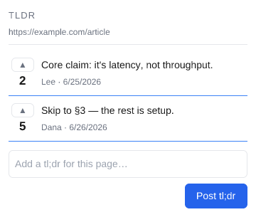 <!-- req-gallery:10.1 -->

</td>
<td valign="top">

`10.1` In **TLDR** mode the panel wears TLDR's look — **blue** comment separators and a **"Post tl;dr"**
composer — showing its notes.

</td>
</tr>
</table>

<table>
<tr>
<td valign="top" width="340">

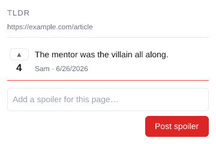 <!-- req-gallery:10.2 -->

</td>
<td valign="top">

`10.2` The **same** panel in **Spoiler** mode wears a **different** look — **red** separators and a
**"Post spoiler"** composer — so the categories are visibly distinct.

</td>
</tr>
</table>

<table>
<tr>
<td valign="top" width="340">

🚩 _Behavior leaf — verified by `behavior/behavior.test.mjs` (a gesture a static snapshot can't show)._ <!-- req-gallery:10.3 -->

</td>
<td valign="top">

`10.3` The panel shows **only the current category's** notes, and **switching** the current category
re-renders to it **without a refetch** (client-side over the one cached read).

</td>
</tr>
</table>

<table>
<tr>
<td valign="top" width="340">

🚩 _Behavior leaf — verified by `behavior/behavior.test.mjs` (a gesture a static snapshot can't show)._ <!-- req-gallery:10.4 -->

</td>
<td valign="top">

`10.4` Posting attaches the **current category** to the note (there's no per-note picker) — it rides
the **POST body** and the new note appears in the current view. _(Cross-tier: server persistence is `10.8`.)_

</td>
</tr>
</table>

<table>
<tr>
<td valign="top" width="340">

🔧 _Logic leaf — verified by `logic/logic.test.mjs`._ <!-- req-gallery:10.5 -->

</td>
<td valign="top">

`10.5` The composer copy is **per-category** — the **Post** label and the textarea **placeholder** come
from the active category's design (e.g. TLDR → **"Post tl;dr"**).

</td>
</tr>
</table>

<table>
<tr>
<td valign="top" width="340">

🔧 _Logic leaf — verified by `logic/logic.test.mjs`._ <!-- req-gallery:10.6 -->

</td>
<td valign="top">

`10.6` Each category's design is **encapsulated** — every rule in its folder is scoped to its own
`body[data-category]` and is **tokens-only** (no behavior) — and the categories define **distinct**
separator colours, so a restyle of one has **zero effect** on another.

</td>
</tr>
</table>

<table>
<tr>
<td valign="top" width="340">

🚩 _Behavior leaf — verified by `behavior/behavior.test.mjs` (a gesture a static snapshot can't show)._ <!-- req-gallery:10.7 -->

</td>
<td valign="top">

`10.7` Picking a category in the **toolbar-icon menu** records it as the **current category** and
**opens the side panel** to it.

</td>
</tr>
</table>

<table>
<tr>
<td valign="top" width="340">

🛡️ _Server leaf — verified by `server/server.test.mjs` (the real handler's response, asserted server-side)._ <!-- req-gallery:10.8 -->

</td>
<td valign="top">

`10.8` `POST /comments` **persists a valid category** and the public projection **returns it**.
_(Cross-tier: the UI half is `10.4`.)_

</td>
</tr>
</table>

<table>
<tr>
<td valign="top" width="340">

🛡️ _Server leaf — verified by `server/server.test.mjs` (the real handler's response, asserted server-side)._ <!-- req-gallery:10.9 -->

</td>
<td valign="top">

`10.9` `POST /comments` with an **unknown category is rejected (400)** and writes nothing; with **no
category** it stores the **default** (Chitchat) — the growable allowlist, not a frozen enum.

</td>
</tr>
</table>

<table>
<tr>
<td valign="top" width="340">

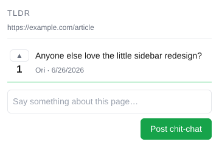 <!-- req-gallery:10.10 -->

</td>
<td valign="top">

`10.10` The panel in **Chitchat** mode wears a third distinct look — **green** separators and a
**"Post chit-chat"** composer — completing the per-category look set (Chitchat is also the default view).

</td>
</tr>
</table>

<table>
<tr>
<td valign="top" width="340">

🚩 _Behavior leaf — verified by `behavior/behavior.test.mjs` (a gesture a static snapshot can't show)._ <!-- req-gallery:10.11 -->

</td>
<td valign="top">

`10.11` The **toolbar icon toggles** the pane: with the pane **closed** the icon opens the **category
menu** (pick → open); with the pane **open** the icon **closes** it. _(The open/close round-trip in a
real browser is the e2e follow-up `8.1`.)_

</td>
</tr>
</table>

<table>
<tr>
<td valign="top" width="340">

🔧 _Logic leaf — verified by `logic/logic.test.mjs`._ <!-- req-gallery:10.12 -->

</td>
<td valign="top">

`10.12` The comments pane makes **no mention of the current selection** — **no badge**, **no filter
bar**, and the notes never name the category; it just shows the relevant comments (the category is
conveyed only by look & copy).

</td>
</tr>
</table>

<table>
<tr>
<td valign="top" width="340">

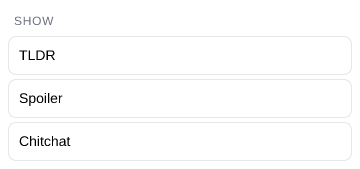 <!-- req-gallery:10.13 -->

</td>
<td valign="top">

`10.13` The **toolbar-icon menu popup** renders a **"Show"** heading and **one button per category**
(TLDR / Spoiler / Chitchat), built from the shared list — the visual for the popup the icon opens.
_(Its click behaviour is `10.7`.)_

</td>
</tr>
</table>

## 11. Link hover preview

Follow-up to the categories/upvoting ranking deferral noted in §10: while browsing, hovering an
**http(s) link** shows a small popup with the **leading (top-voted) comment** for that link's URL, in
the reader's **currently selected category** — a TLDR for every link on the page, without opening the
panel. This is the one feature that reaches **beyond the extension's own pages**: it runs as a
DYNAMICALLY-registered content script (`client/src/link-hover.mjs`) on an arbitrary third-party page,
opted into per the options-page toggle (`11.10`), never declared statically in the manifest (`11.11`) —
so the host-access it needs is requested, and can be revoked, only through that one gesture (§12,
"optional permission, opt-in via toggle").

The **leading comment** is served by a new, dedicated endpoint — `GET /comments/top` — backed by a new
`CategoryRankIndex` GSI keyed on `pageId#category` and sorted by `voteCount` (`11.1`–`11.4`); the base
table's `pageId`/`commentId` key schema stays untouched (only a GSI was added, not a key-schema change).
**Known limitation:** a GSI only indexes items that already carry its key attributes at write time, so a
comment posted **before** this shipped is invisible to the ranking query until it's rewritten — there is
no backfill (consistent with the project's existing no-migration, default-at-read-time treatment of
`category` itself).

On the client, hovering a link is gated exactly like the side panel gates the active tab — reusing
`evaluatePage` (the same http(s)-only + per-site-denylist rule, `11.5`–`11.6`) — before any lookup is
even attempted. The category used for a lookup is always read fresh from `chrome.storage.local` at
hover time, never one cached when the content script loaded (`11.9`), so switching category via the
toolbar menu changes what the NEXT hover shows without a page reload. Per the owner-chosen empty-state
decision: a link with no leading comment in the current category shows **nothing** (`11.8`) — this stays
a purely passive, read-only affordance. A shown popup is styled independently of the panel's
`body[data-category]` theming (that selector has no meaning on a third-party page) but still names the
category via the same design registry (`11.7`).

<table>
<tr>
<td valign="top" width="340">

`GET /comments/top?pageUrl=https://example.com/x&category=tldr` — public → `200` <!-- req-gallery:11.1 -->

</td>
<td valign="top">

`11.1` `GET /comments/top?pageUrl=…&category=…` returns the **highest-`voteCount` comment** for that
page + category, via the `CategoryRankIndex` GSI — the same public allowlist projection as
`GET /comments` (no internal field leaks).

</td>
</tr>
</table>

<table>
<tr>
<td valign="top" width="340">

`GET /comments/top?pageUrl=https://example.com/x&category=spoiler` — public → `200` <!-- req-gallery:11.2 -->

</td>
<td valign="top">

`11.2` When nothing has been posted in that page + category yet, `GET /comments/top` returns **`{
comment: null }` with a `200`** — an absent leader is an expected empty state, never a `404`/error.

</td>
</tr>
</table>

<table>
<tr>
<td valign="top" width="340">

`GET /comments/top?pageUrl=https://example.com/x` — public (no category param) → `200` <!-- req-gallery:11.3 -->

</td>
<td valign="top">

`11.3` `GET /comments/top` with **no `category`** defaults to `DEFAULT_CATEGORY` — the additive-only
optional-parameter contract (§9.1), mirroring the write-side default an older/absent category resolves
to.

</td>
</tr>
</table>

<table>
<tr>
<td valign="top" width="340">

`GET /comments/top?pageUrl=https://example.com/x&category=rating` — public → `400` unknown category: rating <!-- req-gallery:11.4 -->

</td>
<td valign="top">

`11.4` `GET /comments/top` with an **unknown, present** category value is rejected (`400`) before any
query runs — the same validation `resolveCategory` already applies on write.

</td>
</tr>
</table>

<table>
<tr>
<td valign="top" width="340">

🔧 _Logic leaf — verified by `logic/logic.test.mjs`._ <!-- req-gallery:11.5 -->

</td>
<td valign="top">

`11.5` A hovered link is a lookup **candidate only if its href is http(s)** — `mailto:`, `javascript:`,
and any other non-http(s) scheme never trigger a lookup at all (no network call, no popup).

</td>
</tr>
</table>

<table>
<tr>
<td valign="top" width="340">

🔧 _Logic leaf — verified by `logic/logic.test.mjs`._ <!-- req-gallery:11.6 -->

</td>
<td valign="top">

`11.6` A hovered link whose host is on the reader's **per-site denylist** (the SAME synced denylist the
side panel honors, §4.2) is never a lookup candidate — no network call, no popup, for that host.

</td>
</tr>
</table>

<table>
<tr>
<td valign="top" width="340">

🚩 _Behavior leaf — verified by `behavior/behavior.test.mjs` (a gesture a static snapshot can't show)._ <!-- req-gallery:11.7 -->

</td>
<td valign="top">

`11.7` Hovering a candidate link **with** a leading comment shows a popup — after a short debounce —
naming the current category and the comment's body/author; moving off the link removes it.

</td>
</tr>
</table>

<table>
<tr>
<td valign="top" width="340">

🚩 _Behavior leaf — verified by `behavior/behavior.test.mjs` (a gesture a static snapshot can't show)._ <!-- req-gallery:11.8 -->

</td>
<td valign="top">

`11.8` Hovering a candidate link with **no** leading comment in the current category shows **nothing**
— the owner-chosen empty state (no "no notes yet" placeholder either).

</td>
</tr>
</table>

<table>
<tr>
<td valign="top" width="340">

🚩 _Behavior leaf — verified by `behavior/behavior.test.mjs` (a gesture a static snapshot can't show)._ <!-- req-gallery:11.9 -->

</td>
<td valign="top">

`11.9` The category used for a lookup is read **fresh from storage at hover time**: changing the
current category between two hovers changes what the *second* hover looks up, with no page reload.

</td>
</tr>
</table>

<table>
<tr>
<td valign="top" width="340">

🚩 _Behavior leaf — verified by `behavior/behavior.test.mjs` (a gesture a static snapshot can't show)._ <!-- req-gallery:11.10 -->

</td>
<td valign="top">

`11.10` The **options-page toggle** ("Show hover previews on web pages") requests exactly the
hover-preview host origins and registers the content script on grant (declining leaves it off);
unchecking it unregisters the script and **revokes** the granted permission.

</td>
</tr>
</table>

<table>
<tr>
<td valign="top" width="340">

🔧 _Logic leaf — verified by `logic/logic.test.mjs`._ <!-- req-gallery:11.11 -->

</td>
<td valign="top">

`11.11` The shipped manifest requests the link-hover host access **only as `optional_host_permissions`**
(`http://*/*`, `https://*/*`) alongside the `scripting` permission — never as a static `host_permissions`
or `content_scripts` entry, so no user sees a new install-time warning.

</td>
</tr>
</table>

<table>
<tr>
<td valign="top" width="340">

⚠️ _Behavior leaf — **untested here** — covered today by `node --check of the chrome.* glue in .github/workflows/client.yml (a real-Chrome e2e is a tracked follow-up)`._ <!-- req-gallery:11.12 -->

</td>
<td valign="top">

`11.12` **(tbd)** The dynamically-registered content script actually intercepts hovers on a **real
third-party page in a real Chrome** — the harness cases (`11.5`–`11.10`) prove the model; only a
real-Chrome e2e (the same tracked follow-up as `8.1`) proves the registration itself fires there.

</td>
</tr>
</table>
